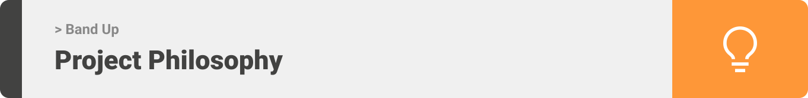
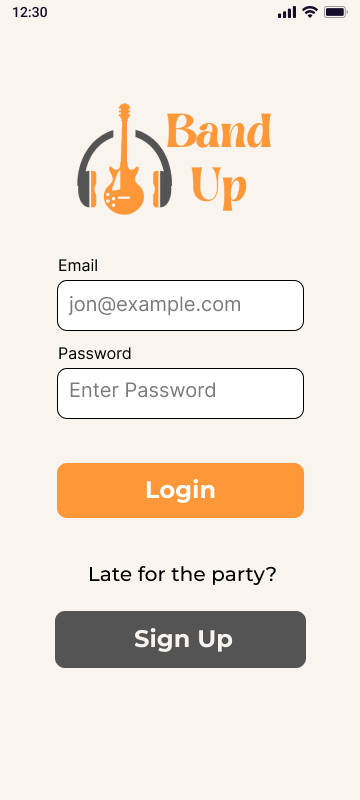
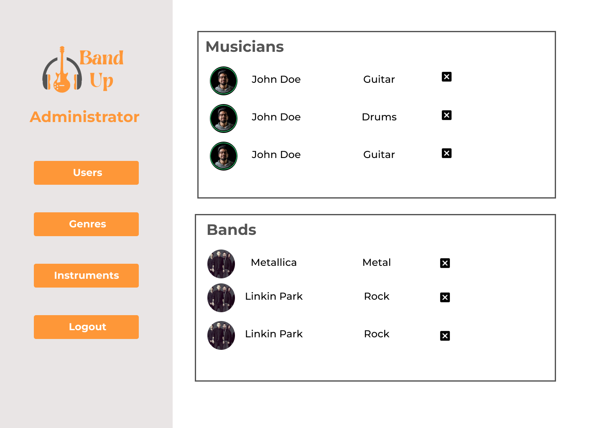
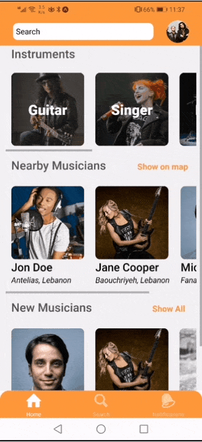
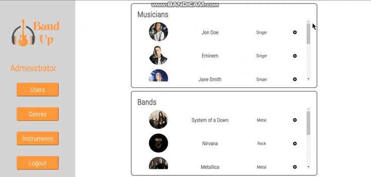
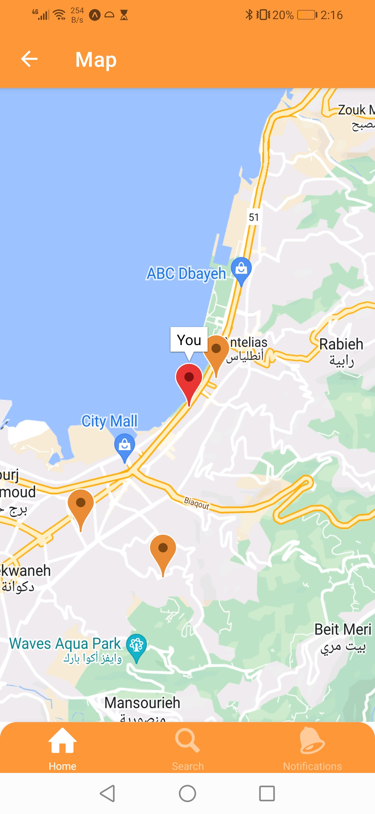
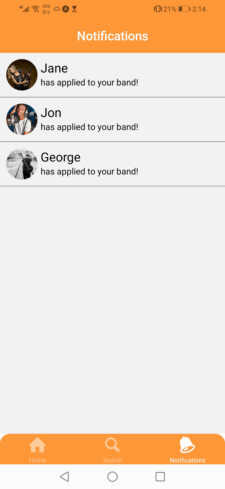

<div align="center">

> Hello world! This is the project’s summary that describes the project plain and simple, limited to the space available.

**[PROJECT PHILOSOPHY](#project-philosophy) • [WIREFRAMES](#wireframes) • [TECH STACK](#tech-stack) • [IMPLEMENTATION](#implementation) • [HOW TO RUN?](#how-to-run)**

</div>

<br><br>



> Band Up is a mobile app that helps musicians and bands discover and connect with each other. The app's purpose is to help musicians further their musical career by finding and joining the right band. Bands can also find the right musical talent according to their needs.

### User Stories

#### Musician

- As a musician, I want to upload a video to showcase my skills.
- As a musician, I want to browse bands, so that I can watch their demo video.
- As a musician, I want to locate nearby bands.
- As a musician, I want to call a band.
- As a musician, I want to apply to bands by sending them a push notification.

#### Band

- As a band, I want to upload a video to demonstrate our musical style.
- As a band, I want to browse musicians, so that I can watch their demo video.
- As a band, I want to locate nearby musicians.
- As a band, I want to call a musician.
- As a band, I want to show my interest in musicians by sending them a push notification.

#### Admin

- As the admin, I want to browse all the users, so that I can remove a user from the app.
- As the admin, I want to browse and add new genres and instruments.

<br><br>

<center>

**[BACK TO TOP](#top)**

</center>


> This design was planned before on paper, then moved to the Figma app for the fine details.
> Note that i didn't use any styling library or theme, all was done from scratch and using pure css modules.

| Login                           | Register                          | Register as a Band                     | Register as a Musician                     |
| ------------------------------- | --------------------------------- | -------------------------------------- | ------------------------------------------ |
|  |  |  |  |

| Home                                | Users List                           | Profile                                                   | User's Profile                              |
| ----------------------------------- | ------------------------------------ | --------------------------------------------------------- | ------------------------------------------- |
|  |  |  |  |

<br>

## Admin

| Users                           | Genres/Instruments                  |
| ------------------------------- | ----------------------------------- |
|  |  |

<br><br>

<center>

**[BACK TO TOP](#top)**

</center>


Here's a brief high-level overview of the tech stack the Band Up app uses:

- This project was developed using [React Native](https://reactnative.dev/) and [Expo](https://docs.expo.dev/) Cross-Platform Mobile Development tools. Expo is a framework to build React Native apps. It is a set with tools and services built for React Native.
- The backend of the app uses [Express](https://expressjs.com/), the [Node.js](https://nodejs.org/) web application framework. Express is a minimal and flexible Node.js web application framework that provides a robust set of features for web and mobile applications.
- For persistent storage (database), the app uses [MongoDB](https://www.mongodb.com/), a noSQL database which allows storing data in flexible, JSON-like documents, meaning fields can vary from document to document and data structure can be changed over time.
- For displaying maps and users' location, the app uses [React Native Maps](https://github.com/react-native-maps/react-native-maps) which is a component system for maps that ships with platform-native code that needs to be compiled together with React Native.
- To send push notifications, the app uses [expo-notifications](https://docs.expo.dev/push-notifications/overview/) package which supports Android, and iOS.

<br><br>

<center>

**[BACK TO TOP](#top)**

</center>


> Using the above mentioned tech stacks and the wireframes built with Figma from the user stories we have, the implementation of the app is shown as below, these are animations from the real app.

| Register                                   | Band Home Screen                             | Musician Home Screen                             | Edit Profile                                    |
| ------------------------------------------ | -------------------------------------------- | ------------------------------------------------ | ----------------------------------------------- |
|  |  |  |  |

| Nearby Users                         | Upload Video                                  | Search                                    | Make a Call                                    |
| ------------------------------------ | --------------------------------------------- | ----------------------------------------- | ---------------------------------------------- |
|  |  |  |  |

<center>

| Sending/Receiving Notifications                                                         |
| --------------------------------------------------------------------------------------- |
|   |

</center>

<br>

## Admin

> These are animations from the admin web app.

<center>

| Delete User                              |
| ---------------------------------------- |
|  |

| Unauthorized user                               |
| ----------------------------------------------- |
|  |

| Add Genre                                    |
| -------------------------------------------- |
|  |

| Add Instrument                                    |
| ------------------------------------------------- |
|  |

</center>

> Below are some screenshots from the app.

| Band Home Screen                               | Musician Home Screen                               | All users screen                        |
| ---------------------------------------------- | -------------------------------------------------- | --------------------------------------- |
|  |  |  |

| Musician Profile                               | Band Profile                               | Map Screen                        |
| ---------------------------------------------- | ------------------------------------------ | --------------------------------- |
|  |  |  |

| Notifications                               | Profile Screen                               | Profile Screen with video                          |
| ------------------------------------------- | -------------------------------------------- | -------------------------------------------------- |
|  |  |  |

<br><br>

<center>

**[BACK TO TOP](#top)**

</center>


> To get a local copy up and running follow these simple example steps.

### Prerequisites

- Download and install [Node.js](https://nodejs.org/en/)

- npm
  ```sh
  npm install npm@latest -g
  ```
- Expo CLI
  ```sh
  npm install --global expo-cli
  ```
- Download the Expo Go mobile app from the app store

### Installation

#### React Native:

1. Clone the repo
   ```sh
   git clone https://github.com/Michel-Haddad77/BandUp-Final-Project
   ```
2. Navigate to the frontend folder and install dependencies
   ```sh
   cd BandUp-final-project/react-native-frontend
   npm install
   ```
3. Navigate to the "url" file in the constants folder and change the ip address to your own

4. Run the start up command
   ```sh
   expo start
   ```
5. Scan the generated QR code with your camera (ios) or through the Expo Go application (android).

#### Node.js:

2. Navigate to the backend folder and install dependencies

   ```sh
   cd BandUp-final-project/nodejs-backend
   npm install
   ```

3. Seed the admin credentials by running the following command

   ```sh
   npm run seed
   ```

4. Seed the genres and instruments by running the following command

   ```sh
   npm run seed-genres
   ```

5. Create your own .env file with the following variables

   ```sh
   DB_CONNECT =
   TOKEN_SECRET  =
   ```

6. Create a file with the name "uploads" to store the uploaded videos

7. To start, run the command
   ```sh
   npm start
   ```
