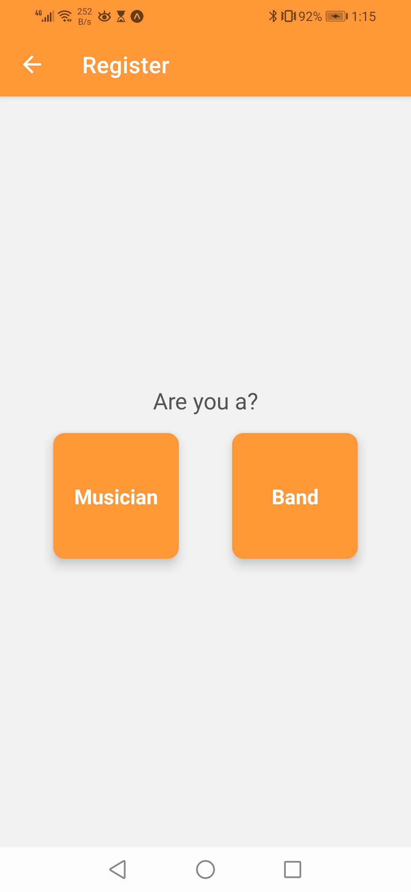

<div align="center">

> Hello world! This is the project’s summary that describes the project plain and simple, limited to the space available.

**[PROJECT PHILOSOPHY](https://github.com/Michel-Haddad77/BandUp-Final-Project#-project-philosophy) • [WIREFRAMES](https://github.com/Michel-Haddad77/BandUp-Final-Project#-wireframes) • [TECH STACK](https://github.com/Michel-Haddad77/BandUp-Final-Project#-tech-stack) • [IMPLEMENTATION](https://github.com/Michel-Haddad77/BandUp-Final-Project#-implementation) • [HOW TO RUN?](https://github.com/Michel-Haddad77/BandUp-Final-Project#-how-to-run)**

</div>

<br><br>


> Band Up is an app that helps musicians and bands discover and connect with each other.
> Musicians can browse bands by their genre, and bands can browse musicians by their instruments.
> Musicians can discover nearby bands (up to a 5KM radius), and vice versa.
> Users can catch each other's attention by uploading videos showcasing their skills, and showing their interest in each other via push notifications.

### User Stories

- As a musician, I want to browse bands, so that I can watch their video, apply by sending them a push notification, and call them.
- As a band, I want to browse musicians, so that I can watch their video, show interest in their profile by sending a push notification, and call them
- As the admin, I want to see all the users, and delete one in case of misconduct. I also want to browse and add new genres and instruments.

<br><br>


> This design was planned before on paper, then moved to the Figma app for the fine details.
> Note that i didn't use any styling library or theme, all was done from scratch and using pure css modules.

| Home                                | Profile                                                   |
| ----------------------------------- | --------------------------------------------------------- |
|  |  |

| User's Profile                              | Notifications                                |
| ------------------------------------------- | -------------------------------------------- |
|  |  |

<br><br>


The app
Here's a brief high-level overview of the tech stack the Band Up app uses:

- This project was developed using [React Native](https://reactnative.dev/) and [Expo](https://docs.expo.dev/) Cross-Platform Mobile Development tools. Expo is a framework to build React Native apps. It is a set with tools and services built for React Native.
- The backend of the app uses [Express](https://expressjs.com/), the [Node.js](https://nodejs.org/) web application framework. Express is a minimal and flexible Node.js web application framework that provides a robust set of features for web and mobile applications.
- For persistent storage (database), the app uses [MongoDB](https://www.mongodb.com/), a noSQL database which allows storing data in flexible, JSON-like documents, meaning fields can vary from document to document and data structure can be changed over time.
- For displaying maps and the users' location, the app uses React Native Maps which is a component system for maps that ships with platform-native code that needs to be compiled together with React Native.
- To send push notifications, the app uses [expo-notifications](https://docs.expo.dev/push-notifications/overview/) package which supports Android, and iOS.

<br><br>


> Using the above mentioned tech stacks and the wireframes built with Figma from the user stories we have, the implementation of the app is shown as below, these are screenshots from the real app

| Login Screen                       | Register Screen                        | Register as a Band Screen                      | Register as a Musician                             |
| ---------------------------------- | -------------------------------------- | ---------------------------------------------- | -------------------------------------------------- |
|  |  |  |  |

| Band Home Screen                              | Musician Home Screen                               | Profile Screen                             | Profile Screen with video                        |
| --------------------------------------------- | -------------------------------------------------- | ------------------------------------------ | ------------------------------------------------ |
|  |  |  |  |

| Band Profile                              | Musician Profile                               |
| ----------------------------------------- | ---------------------------------------------- |
|  |  |

<br><br>


> To get a local copy up and running follow these simple example steps.

### Prerequisites

- Download and install [Node.js](https://nodejs.org/en/)
- Download and in

- npm
  ```sh
  npm install npm@latest -g
  ```
- Expo CLI
  ```sh
  npm install --global expo-cli
  ```
- Download Expo Go mobile app from the app store

### Installation

_Below is an example of how you can instruct your audience on installing and setting up your app. This template doesn't rely on any external dependencies or services._

### Installation

#### React Native:

1. Clone the repo
   ```sh
   git clone https://github.com/Michel-Haddad77/BandUp-Final-Project
   ```
2. Navigate to the Frontend folder and install dependencies
   ```sh
   cd BandUp-final-project/react-native-frontend
   npm install
   ```
3. Run the start up command
   ```sh
   expo start
   ```
4. Scan the generated QR code with your camera (ios) or through the Expo Go application (android).

#### Node.js:

2. Navigate to the backend folder and install dependencies

   ```sh
   cd BandUp-final-project/nodejs-backend
   npm install
   ```

3. Seed the admin credentials by running the following command

   ```sh
   npm run seed
   ```

4. Seed the genres and instruments by running the following command

   ```sh
   npm run seed-genres
   ```

5. To start, run the command
   ```sh
   npm start
   ```
